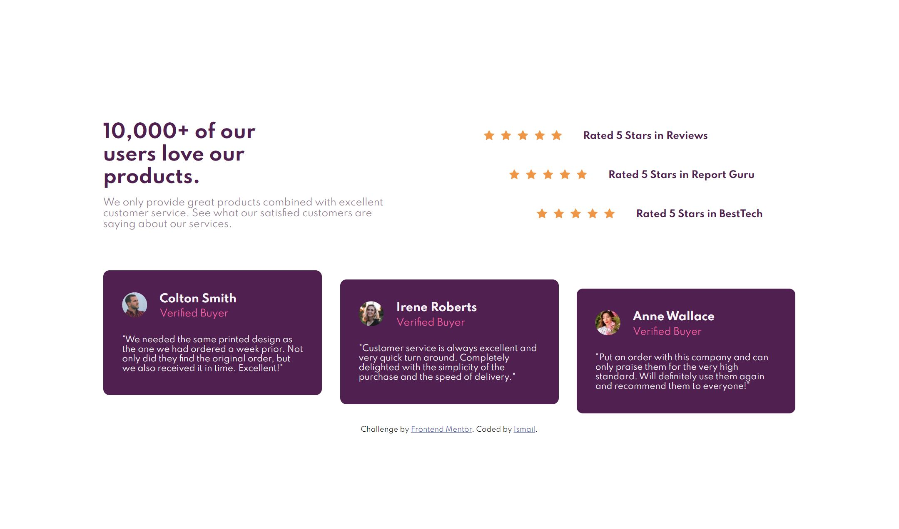

# Frontend Mentor - Social proof section solution

This is a solution to the [Social proof section challenge on Frontend Mentor](https://www.frontendmentor.io/challenges/social-proof-section-6e0qTv_bA). Frontend Mentor challenges help you improve your coding skills by building realistic projects.

## Table of contents

- [Overview](#overview)
  - [The challenge](#the-challenge)
  - [Screenshot](#screenshot)
  - [Links](#links)
- [My process](#my-process)
  - [Built with](#built-with)
  - [What I learned](#what-i-learned)
- [Author](#author)

## Overview

To create a social proof section component as close to the design files provided.

### The challenge

Users should be able to:

- View the optimal layout depending on their device's screen size

### Screenshot



### Links

- Solution URL: [here](https://github.com/Ishi1834/social-proof-section-main)
- Live Site URL: [here](https://ishi1834.github.io/social-proof-section-main/)

### Built with

- Semantic HTML5 markup
- CSS custom properties
- Flexbox
- CSS Grid
- Mobile-first workflow

### What I learned

How to use grid to create a layout and when to use vw or px while creating a responsive page:

```css
.container {
  display: grid;
  grid-template-columns: auto auto;
}
```

```css
br {
  display: block;
  content: "";
  margin: 5px;
}
```

## Author

- Github - [@Ishi1834](https://github.com/Ishi1834)
- Frontend Mentor - [@Ishi1834](https://www.frontendmentor.io/profile/Ishi1834)
- CodePen - [@sadiq1834](https://codepen.io/sadiq1834)
